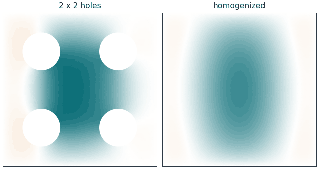
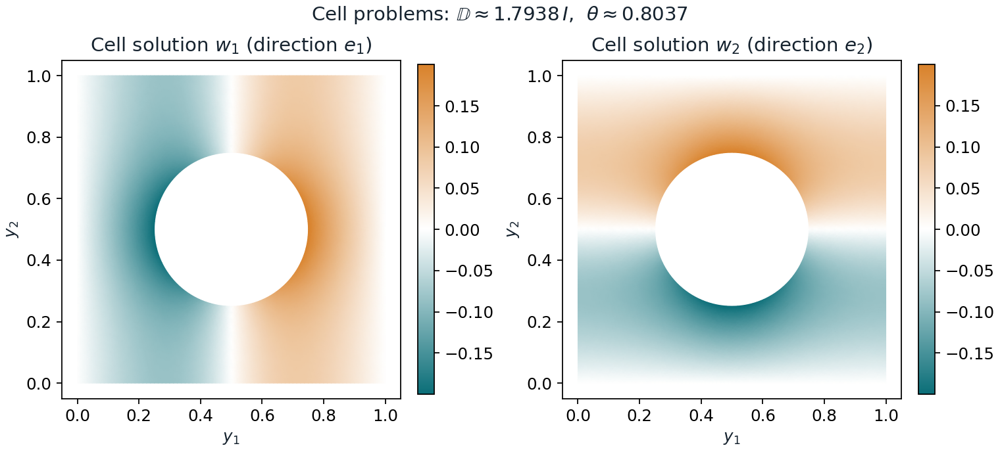
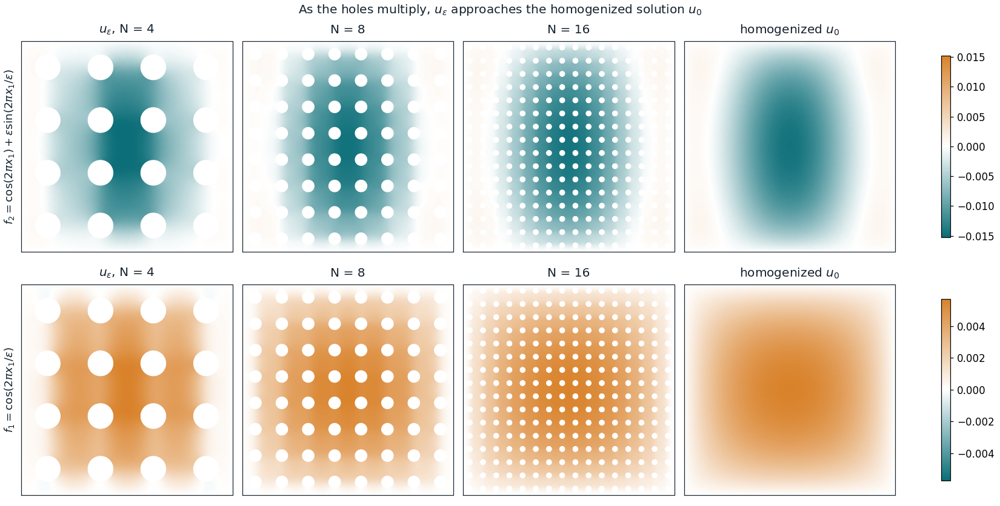
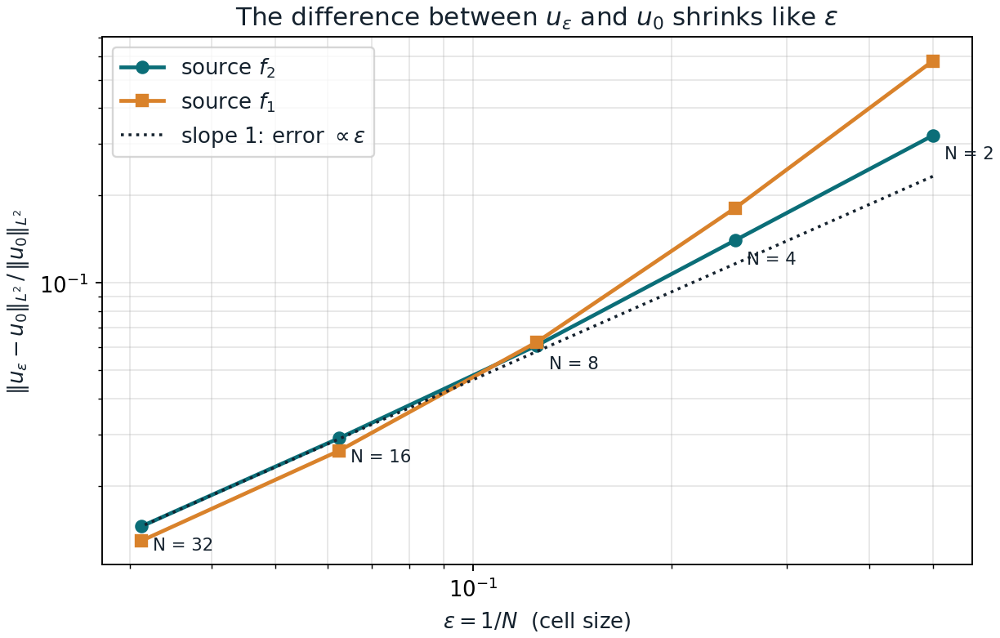

# Homogenization in a perforated domain

A diffusion problem in a material full of small holes, solved two ways: directly,
with every hole in the mesh, and through **homogenization**, which replaces the
holes and the rapidly varying coefficients by one effective material. The code
computes the effective coefficients from the periodic cell problems and shows
that the two solutions agree better and better as the holes get smaller, at the
rate the theory predicts.



## Background

This started as a group project in the course *MAAD28 Homogenization:
Multiscale Modeling, Analysis and Simulation* at Karlstad University, Sweden
(autumn 2023, presented on 11 January 2024), by

- [Samuel Agenorwoth](https://www.linkedin.com/in/samuel-agenorwoth-b30828216)
- [John Success Lazarus](https://www.linkedin.com/in/john-lazarus-040b89195/)
- [Ayoola Arinola Ayorinde](https://www.linkedin.com/in/ayoola-ayorinde-8b5a881a3/)
- [Maoni Ngowa Msinda](https://www.linkedin.com/in/maoni-msinda-5285bb1b0/)
- [Hannah Abosede Esinoye](https://www.linkedin.com/in/hannah-esinoye-632521256/)
- [Md Abdul Gafur](https://www.linkedin.com/in/md-abdul-gafur-339155297/)

The group derived the homogenized problem by two-scale convergence and
simulated the original problem in FEniCS and the homogenized one in COMSOL.
This repository is a 2026 rewrite of the numerical part by Samuel Agenorwoth;
see [What this version adds](#what-this-version-adds).

## The problem

The domain $\Omega_\varepsilon$ is the unit square with $N \times N$ circular
holes: the square is divided into cells of size $\varepsilon = 1/N$, and each
cell has a hole of radius $\varepsilon/4$ in its middle. On it we solve

```math
-\mathrm{div}\!\left(A\!\left(\tfrac{x}{\varepsilon}\right)\nabla u_\varepsilon\right) + u_\varepsilon = f_\varepsilon \ \text{ in } \Omega_\varepsilon, \qquad
A\!\left(\tfrac{x}{\varepsilon}\right)\nabla u_\varepsilon \cdot n = 0 \ \text{ on the holes}, \qquad
u_\varepsilon = 0 \ \text{ on the outer boundary,}
```

with the coefficient matrix and the two sources of the original project:

```math
A(y) = \begin{pmatrix} 3 + \cos 2\pi y_1 & 0 \\ 0 & 3 + \cos 2\pi y_2 \end{pmatrix}, \qquad
f_1 = \cos\frac{2\pi x_1}{\varepsilon}, \qquad
f_2 = \cos(2\pi x_1) + \varepsilon \sin\frac{2\pi x_1}{\varepsilon}.
```

The coefficient oscillates on the scale of the cells, and nothing can flow
through the holes.

## The homogenized problem

As $\varepsilon \to 0$, $u_\varepsilon$ converges to the solution $u_0$ of a
problem on the full square, without holes and with constant coefficients:

```math
-\mathrm{div}(\mathbb{D}\nabla u_0) + \theta\, u_0 = F \ \text{ in } (0,1)^2, \qquad u_0 = 0 \ \text{ on the boundary.}
```

Writing $Y^*$ for one cell (the unit square) without its hole:

- $\theta = |Y^*| = 1 - \pi/16$ is the fraction of material that is not hole,
- $F$ is the limit of the source over the material: $F = \theta\cos(2\pi x_1)$
  for $f_2$, and the constant $F = \int_{Y^*}\cos(2\pi y_1)\,dy$ for $f_1$,
- $\mathbb{D}$ is the effective diffusion tensor,
  $\mathbb{D}_{ik} = \int_{Y^*} \big(A(y)(e_k + \nabla w_k)\big)_i \,dy$,
  where the **cell problems** give $w_1, w_2$: periodic functions on $Y^*$ with

```math
-\mathrm{div}_y\!\big(A(y)(e_k + \nabla_y w_k)\big) = 0 \ \text{ in } Y^*, \qquad
A(y)(e_k + \nabla_y w_k)\cdot n = 0 \ \text{ on the hole.}
```

## Method

Everything is solved with linear (P1) finite elements written with NumPy and
SciPy; [gmsh](https://gmsh.info) makes the meshes.

- **Cell problems** (`cell.py`): a periodic mesh of one cell, with matching
  nodes on opposite sides so that those nodes share one unknown. The solution
  is fixed up to a constant, which is removed by requiring zero average.
- **Original problem** (`eps_problem.py`): the full perforated square. The
  no-flux condition on the holes is the natural condition of the weak form, so
  it needs no extra work.
- **Homogenized problem** (`homogenized.py`): the plain square with $\mathbb{D}$,
  $\theta$ and $F$ from the cell problems.
- The oscillating coefficients and sources are integrated with a 6-point
  quadrature rule on every triangle.

## Results

### The effective coefficients



The cell problems give $\mathbb{D} \approx 1.7938\, I$ and $\theta \approx 0.8037$.
Because the holes block diffusion, $\mathbb{D}$ is much smaller than for the
same material without holes. Two checks against known answers:

| Check | Exact or reference | Computed (mesh size 0.0125) |
|---|---|---|
| No hole: $\mathbb{D}$ is the harmonic mean of $3 + \cos 2\pi y$, i.e. $2\sqrt{2}$ | 2.828427 | 2.828498 |
| Constant coefficient with the hole: Rayleigh's formula (Perrins et al., 1979) | 0.671627 | 0.671856 |

In both, the error falls by a factor of 4 each time the mesh is halved, the
expected rate for linear elements.

### Convergence as the holes get smaller





| $N$ | $\varepsilon$ | difference, $f_2$ | rate | difference, $f_1$ | rate |
|---:|---:|---:|---:|---:|---:|
| 2  | 1/2  | 0.321 |      | 0.580 |      |
| 4  | 1/4  | 0.140 | 1.20 | 0.181 | 1.68 |
| 8  | 1/8  | 0.061 | 1.20 | 0.063 | 1.53 |
| 16 | 1/16 | 0.029 | 1.06 | 0.027 | 1.24 |
| 32 | 1/32 | 0.015 | 1.01 | 0.013 | 1.03 |

The difference is $\Vert u_\varepsilon - u_0\Vert _{L^2(\Omega_\varepsilon)} / \Vert u_0\Vert _{L^2(\Omega_\varepsilon)}$.
It halves each time $\varepsilon$ is halved, the $O(\varepsilon)$ convergence
predicted by homogenization theory. With 1024 holes ($N = 32$, about 925 000
mesh nodes), the original solution is within 1.5 % of the homogenized one.

**The mesh must be fine compared with the cell.** Each run uses 30 triangles
across one cell. With only 10, the solutions stopped approaching $u_0$ and
settled 2–4 % away from it, because the mesh error around each hole stays the
same for every $N$. Repeating $N = 16$ with 40 triangles per cell changes the
differences by less than 2 %, so the table measures homogenization, not mesh
error.

## What this version adds

The 2023 project derived the homogenized problem, but its numerical part could
not test it: the homogenized problem was solved with placeholder values
($\mathbb{D} = 4$, $\theta = 1$, $f = 1$) instead of values from the cell
problems, on a different domain than the original problem, and the original
problem was compared only by eye on meshes too coarse for its many holes.
This version

1. solves the cell problems and checks them against two known answers,
2. solves both problems on the same domain with consistent scales,
3. measures the difference and shows the convergence rate,
4. uses only open-source Python, without FEniCS or COMSOL.

## Repository structure

```
homogenization-perforated-domain/
├── README.md
├── LICENSE
├── requirements.txt
├── figures/               figures used in this README
└── src/
    ├── problem.py         coefficient matrix, sources, hole radius
    ├── mesh.py            meshes with gmsh (periodic cell, perforated square)
    ├── fem.py             P1 finite element assembly with quadrature
    ├── cell.py            cell problems, D and theta, with the checks
    ├── eps_problem.py     the original problem with N x N holes
    ├── homogenized.py     the homogenized problem
    ├── convergence.py     the convergence study
    ├── figures.py         figures and animation
    └── run_all.py         runs the study and the figures
```

## How to run

You need Python 3 with NumPy, SciPy, Matplotlib, Pillow and gmsh.

```bash
pip install -r requirements.txt
cd src
python cell.py
python convergence.py
python figures.py
```

`cell.py` solves the cell problems and runs the checks (about half a minute),
`convergence.py` runs the convergence study (a few minutes), and `figures.py`
makes the figures in `figures/`.

## References

1. D. Cioranescu and J. Saint Jean Paulin, "Homogenization in open sets with
   holes", *Journal of Mathematical Analysis and Applications* 71, 590–607, 1979.
2. G. Allaire, "Homogenization and two-scale convergence", *SIAM Journal on
   Mathematical Analysis* 23(6), 1482–1518, 1992.
3. D. Cioranescu and P. Donato, *An Introduction to Homogenization*, Oxford
   University Press, 1999.
4. W. T. Perrins, D. R. McKenzie and R. C. McPhedran, "Transport properties of
   regular arrays of cylinders", *Proceedings of the Royal Society of London A*
   369, 207–225, 1979.

## Author

Samuel Agenorwoth, doctoral researcher in Computational Engineering at LUT
University, Finland. [samuelagenorwoth.com](https://samuelagenorwoth.com)

Licensed under the [MIT License](LICENSE).
